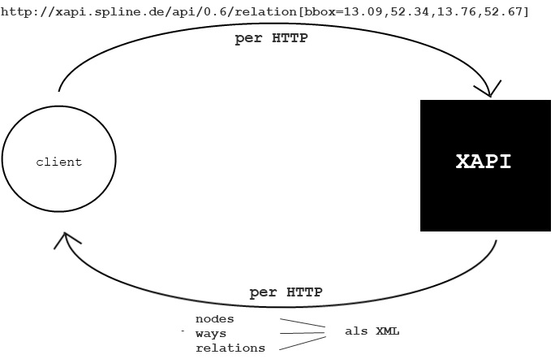
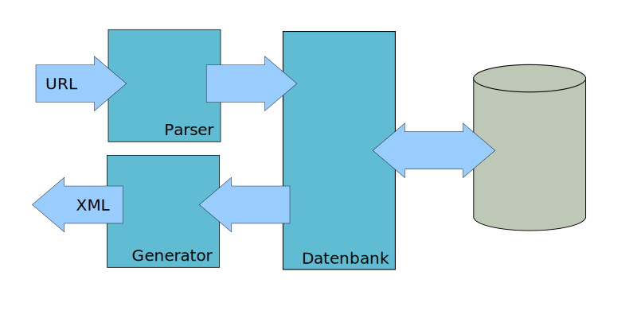
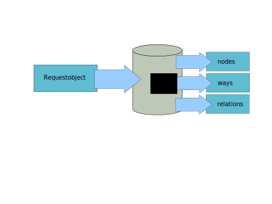
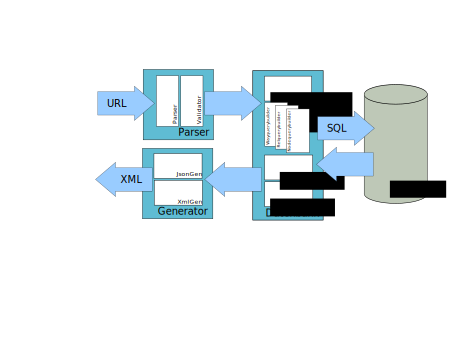

% xappy.js
% Dozentin: Katinka Wolter
% Softwareprojekt Telematik

Übersicht
=========

 

1. Überblick   (Christoph)
2. Gründe für eine Neuimplementierung  (Irena)
3. Implementierung  (Mark)
4. Retrospektive   (Robin)

Team
====

 
 
<table>
<tbody>
<tr>
<td>
           Philipp Borgers
</td>
<td style="width: 200px;">
&nbsp;
</td>
<td>
           Yves Müller
</td>
</tr>
<tr>
<td>
           Lyudmila Vaseva
</td>
<td style="width: 200px;">
&nbsp;
</td>
<td>
           Irena Kpogbezan
</td>
</tr>
<tr>
<td>
           David Hirsch
</td>
<td style="width: 200px;">
&nbsp;
</td>
<td>
           Dario Brand
</td>
</tr>
<tr>
<td>
           Mark Engel
</td>
<td style="width: 200px;">
&nbsp;
</td>
<td>
           Alex Sulfrian
</td>
</tr>
<tr>
<td>
           Robin Nehls
</td>
<td style="width: 200px;">
&nbsp;
</td>
<td>
           Mohammed Keita
</td>
</tr>
<tr>
<td>
           Andreas Nüßlein
</td>
<td style="width: 200px;">
&nbsp;
</td>
<td>
           Mareike Ziese
</td>
</tr>
<tr>
<td>
           Christoph Beuck
</td>
<td style="width: 200px;">
&nbsp;
</td>
<td>
           Max Krüger
</td>
</tr>
</tbody>
</table>

OpenStreetMap
=============
<!--
Begrüßung und Einordnung in das Softwareprojekt Telematik
Unser Projekt behandelt die Xapi, ein OpenStreetMap Projekt
-->

Ziel: freie Geodatenbank und   
&nbsp;&nbsp;&nbsp;&nbsp;&nbsp;&nbsp;&nbsp;&nbsp;lizenzkostenfreie Nutzung für Alle  

OpenStreetMap Infrastruktur
===========================

Was ist die Xapi
================

<!--

-->

<!--
An diesem Bild die 3 Objekttypen erklären
mit Beispielen

node kann beispielsweise eine bar sein, oder xxx
ways sind intuitiv wege aber auch beispielsweise grundrisse von gebäuden
relations ...

Es gibt Nodes (Punkte) auf der Karte.
Es gibt Wege. Wege bestehen aus geordneten Punkten.
Es gibt Relationen. Relationen bestehen aus Relationen, Wegen und Knodes

Beispiele für jeden Punkt. FU-Berlin Beispiel.

Die Kafete ist ein Punkt.
Wege sind intuitiv alle Straßen.
Aber auch Gebäude sind als Wege gezeichnet (Informatikfakultät)
kompletter Uni Bereich ist eine Relation.
Diese kann wieder Unter Relationen beinhalten (Beispiel)

 gib mir alle Knoten aus

   /*
   /nodes
   /way
   /relation

gib mir alle alle Bars aus

   /nodes[amenity=bar]

 gib mir alle Bars und Clubs aus

   /nodes[amenity=bar|club]

gib mir alle Bars und Clubs in Berlin aus

   /nodes[amenity=bar|club][bbox=x,x,x,x]

-->

Beispiele für XAPI-Anfragen
===========================

 
 
<table >
<tbody>
<tr>
<td style="font-size=12px;width:300px;">
           Anfrage für alle Knoten:
</td>
<td style="font-size=12px;" style="width: 200px;">
&nbsp;
</td>
<td style="font-size=12px;">
           /node
</td>
</tr>
<tr>
<td> </td>
</tr>
<tr>
<td style="font-size=12px;">
           alle Bars:
</td>
<td style="font-size=12px;" style="width: 200px;">
&nbsp;
</td>
<td style="font-size=12px;">
           /node[amenity=bar]
</td>
</tr>
<tr>
<td> </td>
</tr>
<tr>
<td style="font-size=12px;">
           alle Bars und Clubs:
</td>
<td style="font-size=12px;" style="width: 200px;">
&nbsp;
</td>
<td style="font-size=12px;">
           /node[amenity=bar|club]
</td>
</tr>
<tr>
<td> </td>
</tr>
<tr>
<td style="font-size=12px;">
           alle Bars und Clubs in Berlin:
</td>
<td style="font-size=12px;" style="width: 200px;">
&nbsp;
</td>
<td style="font-size=12px;">
           /node[amenity=bar|club][bbox=13.088,52.341,13.760,52.669]
</td>
</tr>
</tbody>
</table>

Für was wird die xapi benutzt
=============================

 - Overlay über bestehende Karten
 - Replikation
 - Anfragen über Editoren
 - Analyse / Statistiken

xappy.js
========

 - Neuimplementierung der XAPI
 - Notwendigkeit?

Codeaussschnitt
===============

    add(sNode)      ; Public ; Add a node
        ; #sNode = stream object containing node
        ;
        n line,nodeId,users,lat,lon,timestamp,user,uid,version,changeset
        ;
        s line=sNode("current")
        ;
        s nodeId=$p($p(line,"id=""",2),"""",1)
        s version=$p($p(line,"version=""",2),"""",1)
        i $g(^nodetag(nodeId,"@version"))>version d  q  ; Don't load older versions
        . i line["/>" q
        . f  d  i line["</node>" q
        . . s line=$$read^stream(.sNode)
        d delete(nodeId)
        ;
        s lat=$p($p(line,"lat=""",2),"""",1)
        s lon=$p($p(line,"lon=""",2),"""",1)
        i lon["e" s lon=+$tr(lon,"e","E")
        s ^node(nodeId)=lat_$c(0)_lon

<!-- rant -->

Warum nodejs
============

- 10000 Verbindungen in der Sekunde
- asynchrone Events
- Streaming

Zielsetzung xappy.js
====================

 - modulares Design
 - Dokumentation
 - getesteter Code 
 - effiziente Implementierung

Zielsetzung für uns
===================

 - freies Softwareprojekt umsetzen
 - agiles Entwickeln
 - testgetriebenes Entwickeln
 - Erschließen und Verwenden von nodejs

Implementierung
===============

Parser
======

    /node[bbox=10,10,15,15][amenity=bar|club]

    {
        object: "node",
        bbox: {
            left: 10,
            bottom: 10,
            right: 15,
            top: 15
        },
        tag: {
            key: [ "amenity" ],
            value: [ "bar", "club" ]
        }
    }

Datenbankmodul
==============

OutputGenerator
===============

Generiert aus den Ergebnissen JSON oder XML

Detailierte Implementierung
===========================

Seiteneffekte des Projekts
==========================

- Code Coverage in Unit Test implementiert
- Verbesserungen am nodejs postgress Modul
    - Unterstützung für das binäre Clientprotokoll wurde Implementiert
    - in reinem Javascript
    - Tests für die Änderungen
    - Code wartet auf die Aufnahme ins offizielle Projekt

whoosh
======

- Tool zum Importieren von OSM Daten in postgress Datenbanken
- es existieren bereits solche Tools aber ...
    - sie unterstützen unser Datenbankschema nicht
    - und / oder speichern alle Daten auf der Festplatte oder im Ram zwischen
- geschrieben in C++
- streamt geparse Daten direkt in die Datenbank (COPY Befehl)
- zur Zeit noch nicht ganz stabil

Verwendete Technologieen
========================

- Neben Nodejs
- Git als Versionsverwaltung
- Jenkins als Continuous Integration System
- Github als Koordinations und Ticketsystem

Verwendete Arbeitsmethoden
==========================

- Agile Entwicklung nach Crystal Clear mit
    - heufige Realeases
    - automatisiertes Testen
    - Verwendung von Versionsverwaltung
    - ungebundene Komikation
    - Collective Code Ownership
- Stories welche einezelne Problemgruppen abbilden
- ca. 10 minütige Standup Meetings
- Hackweekends mit geballter Entwicklungskraft

Visualisierte Retrospektive des Codes
=====================================

- Coverage der Tests
- SLOC und Github Graphen
- Git History Visualisiert mit Gource

<!-- fancy statistiken machen -->

Fazit
=====

- Funktionsweise wurde implementiert
- Kinderkrankheiten
- Projekt ist Open Source (AGPLv3 und CDDL)
- Releases und Hackweekends haben sich bewährt
- blaues Club Mate Brot ist lecker
- Fritz Cola Brot mit Zitrone nicht so...
